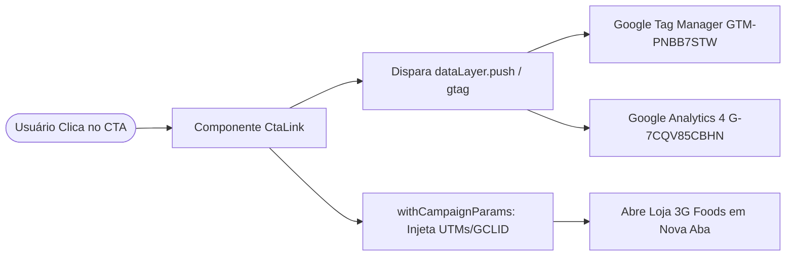
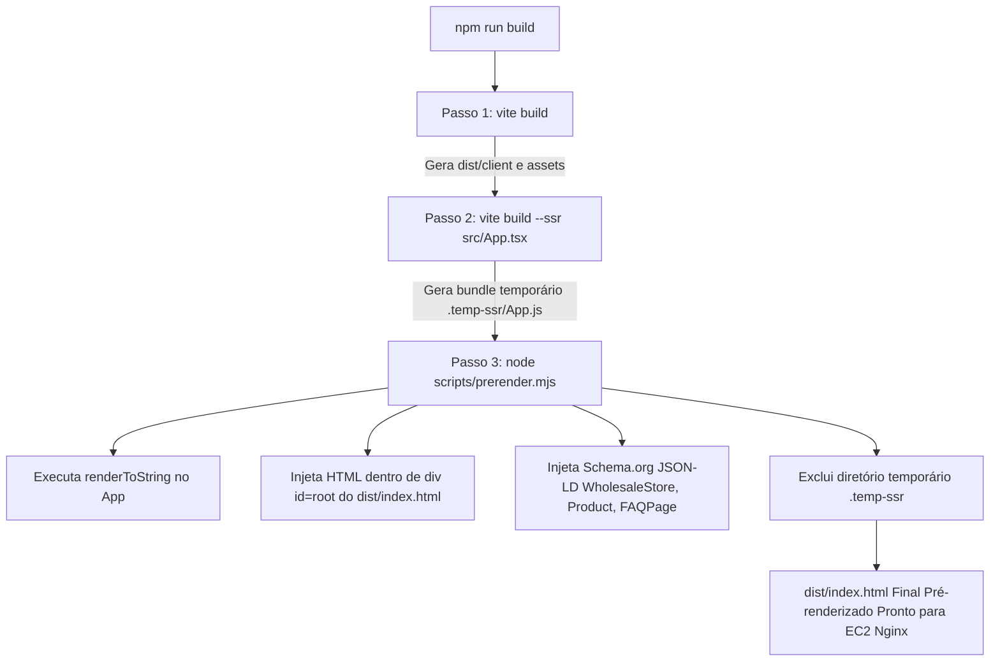

# 📐 Blueprint da Landing Page B2B — 3G Foods (Template Oficial)

> **Documento:** Blueprint Arquitetural, Estrutural e Visual da Landing Page  
> **Aplicação Exemplo:** Muçarela Atacado para Food Service (`/ads/mussarela-atacado-sp-campinas/`)  
> **Tecnologias:** React 19, TypeScript, Vite 8, Tailwind CSS v4, Radix UI, SSG (Prerender Script)  
> **Status:** Produção / SSG Ready  

---

## 🎯 1. Visão Geral e Propósito

Este projeto é o **template padrão de Landing Pages B2B da 3G Foods**. Ele foi concebido para atender campanhas de tráfego pago (Google Ads) e captação orgânica (SEO local/B2B), conectando donos de pizzarias, restaurantes, hamburguerias, padarias e cozinhas profissionais de **São Paulo (Capital e Grande SP)** e **Campinas e região** aos produtos e canais de venda da 3G Foods.

### 🔑 Pilares Arquiteturais:
1. **Desacoplamento Total de Conteúdo:** Todo o conteúdo textual, dados de produtos, links e configurações de campanha residem em um único arquivo de dados (`src/data/landing.ts`).
2. **SSG (Static Site Generation) sem Servidor Ativo:** Compilação com pré-renderização estática via script Node.js (`scripts/prerender.mjs`), entregando HTML 100% populado para o Nginx na EC2 e garantindo First Contentful Paint (FCP) quase instantâneo e indexação imediata por robôs de busca.
3. **Preservação Inteligente de Parâmetros de Tráfego:** Preservação automática de UTMs (`utm_source`, `utm_medium`, `utm_campaign`, etc.) e IDs de rastreio de clique (`gclid`, `gbraid`, `wbraid`) através de um wrapper de link unificado (`<CtaLink />`).
4. **Design System Industrial & Food Service:** Estilização com Tailwind CSS v4 e cores expressas em formato de alta precisão `oklch`, unindo o amarelo da marca 3G Foods (`#FDC800` / `oklch(0.84 0.17 85)`) ao contraste do preto institucional (`--ink`).

---

## 🖼️ 2. Wireframe Estrutural (Mapa Visual da Página)

A anatomia da página segue a metodologia clássica de persuasão e conversão B2B (**AIDA: Atenção ➔ Interesse ➔ Decisão ➔ Ação**), estruturada em 8 blocos visuais ordenados:

```
┌─────────────────────────────────────────────────────────────────────────────┐
│ 1. TRUST BAR (Faixa de Confiança Amarela)                                  │
│    "Distribuidora food service em SP e Campinas | Atendimento PJ"          │
├─────────────────────────────────────────────────────────────────────────────┤
│ 2. HEADER STICKY (Fundo Preto --ink)                                        │
│    [ Logo 3G Foods Colorido ]                         [ CTA Comprar Agora ] │
├─────────────────────────────────────────────────────────────────────────────┤
│ 3. HERO SECTION (Fundo Escuro com Foto de Pizzaria / Forno)                 │
│    • Eyebrow: "● MUSSARELA PARA FOOD SERVICE"                              │
│    • H1: "Mussarela para manter o seu negócio sempre abastecido"            │
│    • Subtítulo explicativo com escopo de entrega SP/Campinas                │
│    • [ CTA 1: Ver mussarelas (Âncora) ]   [ CTA 2: Comprar agora (Loja) ]  │
│    • Microcopy de segurança empresarial                                     │
├─────────────────────────────────────────────────────────────────────────────┤
│ 4. PRODUCT GRID (Vitrine de Produtos - Grelha 3 colunas)                   │
│    • H2: "Mussarelas disponíveis na loja 3G Foods"                         │
│    • Cards de Produtos (Foto 4:3 WebP | Tag | Título | Preço/kg | Comprar)  │
│      [ Apolo ]        [ Bonissimo ]       [ Gran Filata ]                  │
│      [ Latelli ]      [ Moomlac ]         [ Minasa ]                       │
│    • Banner pós-grelha: "Quer ver o catálogo completo?" [ Ver na Loja ]    │
├─────────────────────────────────────────────────────────────────────────────┤
│ 5. APPLICATIONS (Aplicações por Tipo de Negócio - 4 Colunas)                │
│    • H2: "Aplicações por tipo de negócio"                                  │
│      [ Pizzarias ] [ Restaurantes/Lanches ] [ Padarias/Mercados ] [ Cozinhas]│
├─────────────────────────────────────────────────────────────────────────────┤
│ 6. HOW TO BUY (Passo a Passo de Compra - 3 Etapas)                          │
│    • H2: "Como comprar"                                                    │
│      (1) Escolha          (2) Confirme CEP          (3) Finalize Pedido    │
│    • [ CTA: Consultar CEP na Loja ]   [ CTA: Criar Conta Empresarial ]      │
├─────────────────────────────────────────────────────────────────────────────┤
│ 7. STATS (Prova Social & Escala Operacional - Fundo Preto --ink)           │
│    • H2: "Uma operação de distribuição food service"                        │
│      [ +300 produtos ]  [ +15.000 clientes ]  [ +200 municípios ]           │
│      [ +1.400 entregas/dia ] [ +10 anos ]     [ 6 mil m² ] [ 2 mil t/mês ]  │
├─────────────────────────────────────────────────────────────────────────────┤
│ 8. FAQ (Acordeão de Dúvidas Frequentes - Radix UI Accordion)               │
│    • H2: "Dúvidas sobre mussarela no atacado"                              │
│      ▶ A 3G Foods vende mussarela no atacado?                              │
│      ▶ Para quais negócios a mussarela é indicada?                         │
│      ▶ A 3G Foods atende a minha cidade?                                   │
│      ▶ Como consultar preço e disponibilidade?                             │
│      ▶ Posso comprar para o meu restaurante ou pizzaria?                   │
│      ▶ A página mostra todas as mussarelas disponíveis?                    │
├─────────────────────────────────────────────────────────────────────────────┤
│ 9. FINAL CTA (Fechamento de Funil - Fundo Superfície Suave)                │
│    • H2: "Pronto para abastecer a sua operação?"                           │
│    • [ CTA Principal: Comprar agora ]                                       │
├─────────────────────────────────────────────────────────────────────────────┤
│ 10. FOOTER (Rodapé Institucional - Fundo Preto --ink)                       │
│    [ Logo Branco ]                        Links Úteis (Loja / Categoria)    │
│    Dados institucionais de entrega e CEP  Cadastro PJ                       │
│    © 3G Foods - Aviso legal e compliance B2B                                │
└─────────────────────────────────────────────────────────────────────────────┘
```

---

## 🧩 3. Anatomia Detalhada dos Componentes

Todos os componentes da landing page estão localizados em `src/components/landing/`. A lista a seguir detalha a responsabilidade de cada um:

| Componente | Arquivo | Responsabilidade e Elementos Chave |
| :--- | :--- | :--- |
| **`Header`** | `Header.tsx` | Barra de navegação sticky superior. Renderiza a `TrustBar` (topo amarelo) com mensagem de atendimento PJ e SP/Campinas, a logo colorida e o botão rápido "Comprar agora". |
| **`Hero`** | `Hero.tsx` | Seção de impacto inicial (Above the Fold). Background com imagem real de pizzaria com gradiente escuro em `--ink`, H1 persuasivo, dois botões com diferentes intenções (âncora interna e link externo). |
| **`ProductGrid`** | `ProductGrid.tsx` | Vitrine central da oferta. Renderiza o grid responsivo (1 col mobile, 2 tablet, 3 desktop) com dados reais de produtos (preço/kg, marcas, foto WebP otimizada). Possui `IntersectionObserver` para disparo automático do evento `view_item_list`. |
| **`Applications`** | `Applications.tsx` | Seção de segmentação do público-alvo. Apresenta 4 cards com detalhe amarelo indicando a adequação para pizzarias, hamburguerias, padarias e cozinhas industriais. |
| **`HowToBuy`** | `HowToBuy.tsx` | Redutor de atrito. Demonstra a simplicidade do processo de compra em 3 passos numerados (Escolha ➔ CEP ➔ Pedido), com CTAs para consulta de CEP e criação de conta. |
| **`Stats`** | `Stats.tsx` | Prova social quantitativa. Bloco escuro de autoridade com números de grande porte (+15k clientes, +200 municípios, 2 mil toneladas/mês, 6 mil m²). |
| **`Reasons`** *(Opcional)* | `Reasons.tsx` | Componente modular alternativo com 6 diferenciais da 3G Foods (portfólio, abastecimento, distribuição, atendimento, compra online, qualidade). |
| **`Faq`** | `Faq.tsx` | Quebra de objeções. Utiliza componente acessível de Acordeão (`@radix-ui/react-accordion`) com as 6 perguntas mais comuns de clientes B2B. |
| **`FinalCta`** | `FinalCta.tsx` | Fechamento de página. Última oportunidade de conversão antes do rodapé para quem rolou a página até o fim. |
| **`Footer`** | `Footer.tsx` | Rodapé com logo em versão monocromática branca, avisos legais, links de navegação secundária e ano corrente dinâmico. |
| **`CtaLink`** | `CtaLink.tsx` | **Componente utilitário essencial:** encapsula todos os links e botões da página, gerencia estilos (`class-variance-authority`), dispara eventos de analytics para GTM/GA4 e preserva UTMs na URL de destino. |

---

## 🎯 4. Matriz de Conversão, CTAs e Rastreamento (Analytics)

A landing page possui uma camada de tracking customizada (`src/lib/analytics.ts`) integrada com **Google Tag Manager (`GTM-PNBB7STW`)** e **Google Analytics 4 (`G-7CQV85CBHN`)**, sem expor PII (dados pessoais/sensíveis).



### 📊 Tabela de Eventos e Parâmetros Disparados:

| CTA / Seção | Evento GA4/GTM | Parâmetros Enviados | Destino |
| :--- | :--- | :--- | :--- |
| **Carregamento da Página** | `view_landing_mussarela` | `campaign_name`, `page_variant`, `page_location` | Disparado 1x por sessão (`sessionStorage`) |
| **Header** | `select_cta` | `cta_name: "comprar_agora_header"`, `cta_location: "header"`, `destination_type: "category"` | `CATEGORY_URL` |
| **Hero (Primário)** | `select_cta` | `cta_name: "Ver mussarelas disponíveis"`, `cta_location: "hero"`, `destination_type: "anchor"` | Âncora `#mussarelas` |
| **Hero (Secundário)** | `select_cta` | `cta_name: "Comprar agora"`, `cta_location: "hero"`, `destination_type: "category"` | `CATEGORY_URL` |
| **Scroll até a Grelha** | `view_item_list` | `item_list_name: "Mussarelas food service"`, `items: [{item_id, item_name, item_brand, index}]` | Visualização da vitrine |
| **Card de Produto** | `select_cta` + `select_product` | `cta_name: "card_mussarela_[slug]"`, `product_id`, `product_name`, `brand`, `position` | `produto/[slug]` (Página individual) |
| **Pós-Grelha** | `select_cta` | `cta_name: "ver_categoria_pos_grelha"`, `cta_location: "after_grid"`, `destination_type: "category"` | `CATEGORY_URL` |
| **How to Buy (CEP)** | `select_cta` + `cep_check_start` | `cta_name: "consultar_cep"`, `source_location: "how_to_buy"`, `destination_type: "store"` | `CATEGORY_URL` |
| **How to Buy (Cadastro)** | `select_cta` + `begin_signup` | `cta_name: "criar_conta"`, `source_location: "how_to_buy"`, `destination_type: "signup"` | `SIGNUP_URL` |
| **Final CTA** | `select_cta` | `cta_name: "comprar_agora_final"`, `cta_location: "final_cta"`, `destination_type: "category"` | `CATEGORY_URL` |
| **Footer Links** | `select_cta` | `cta_name: "footer_loja" / "footer_categoria" / "footer_cadastro"`, `destination_type: "..."` | Respectivas URLs |

---

## 🗄️ 5. Camada de Dados Centralizada (`src/data/landing.ts`)

O arquivo `src/data/landing.ts` atua como a **Única Fonte da Verdade (SSOT)** da landing page. Qualquer pessoa técnica ou de marketing pode alterar dados de campanha sem mexer no código React.

### Estrutura de Tipos e Constantes:

```typescript
// Configurações de Rastreio e URLs Centrais
export const CAMPAIGN_NAME = "3G Foods - Queijo Mussarela Atacado (SP + Campinas)";
export const PAGE_VARIANT = "control";
export const GA4_MEASUREMENT_ID = "G-7CQV85CBHN";

export const STORE_URL = "https://loja.3gfoods.com.br/";
export const CATEGORY_URL = "https://loja.3gfoods.com.br/busca/1?termo=mussarela";
export const SIGNUP_URL = "https://loja.3gfoods.com.br/";
export const CANONICAL_URL = "https://loja.3gfoods.com.br/ads/mussarela-atacado-sp-campinas";

// Modelo de Produto
export type Product = {
  product_id: string;
  slug: string;
  name: string;
  brand: string;
  image: string;
  priceLabel: string;
  destinationUrl: string;
  trackingLabel: string;
};
```

> [!IMPORTANT]
> **Regra de Compliance do Briefing Comercial:**
> Nunca inventar preços, gramaturas, estoques ou promessas de entrega não confirmadas. Quando um dado depender de CEP, estoque dinâmico ou login PJ, a instrução mandatória é exibir `"Consulte preço e disponibilidade"`.

---

## 🎨 6. Design System & Identidade Visual

O projeto utiliza **Tailwind CSS v4** com importação direta em `src/styles.css` e tokens mapeados no espaço de cores **OKLCH** para máxima fidelidade cromática:

### 🎨 Paleta de Cores Semântica:
* **Amarelo Ação 3G (`--primary` / `--brand`):** `oklch(0.84 0.17 85)` — Utilizado nos botões de conversão de alto destaque, trust bar e detalhes visuais.
* **Amarelo Hover (`--primary-dark`):** `oklch(0.75 0.16 80)` — Estado de hover dos botões de ação primária.
* **Preto Institucional (`--ink`):** `oklch(0.16 0 0)` — Fundo do Header, Hero, Seção de Stats e Rodapé, garantindo contraste premium.
* **Superfícies e Cartões (`--surface`, `--card`, `--background`):** Tons neutros com leve saturação quente para evitar brancos estéreis.
* **Vermelho Prioridade (`--priority` / `--destructive`):** `oklch(0.55 0.2 27)` — Reservado com moderação para alertas ou badges de urgência.

### ✍️ Tipografia:
* **Títulos (`--font-display`):** `Archivo`, 600/700/800, `letter-spacing: -0.015em` — Visual robusto, industrial e firme para manchetes B2B.
* **Texto de Apoio (`--font-sans`):** `Barlow`, 400/500/600/700 — Alta legibilidade para leitura técnica de fichas e FAQs.

---

## ⚙️ 7. Ciclo de Build e Engenharia SSG

O projeto utiliza um pipeline híbrido de compilação estática com **SSG Prerender**:



### Por que esse fluxo é superior?
1. **Zero Sobrecarga de Servidor:** Não necessita de PM2, Docker ou Node.js rodando na EC2. O Nginx atende a página como arquivo estático ultra-rápido.
2. **SEO Perfeito:** Mecanismos de busca (Google, Bing) e agentes de IA recebem imediatamente o conteúdo completo sem aguardar a fila de execução JavaScript (*Two-Wave Indexing*).
3. **Dados Estruturados Rich Snippets:** Injeção automática no `<head>` de esquemas Schema.org:
   - `WholesaleStore` (Dados da distribuidora 3G Foods, áreas atendidas e meios de pagamento).
   - `Product` & `AggregateOffer` (Ficha do produto e oferta B2B).
   - `FAQPage` (Perguntas e respostas elegíveis para rich snippets no Google).

---

## 🚀 8. Guia Rápido: Como Criar uma Nova Landing Page a partir deste Template

Para lançar uma nova landing page (ex: *Queijo Prato*, *Batata Congelada*, *Catupiry*, *Carnes para Hamburgueria*) usando este template:

1. **Clonar a base:** Duplicar este repositório para o novo produto.
2. **Atualizar `src/data/landing.ts`:**
   - Alterar `CAMPAIGN_NAME` e `CANONICAL_URL`.
   - Modificar os textos do objeto `hero` (headline, subheadline, microcopy).
   - Substituir a lista `products` com os SKUs, imagens e preços do novo produto.
   - Ajustar os textos de `applications`, `stats` e as perguntas do `faq`.
3. **Substituir Assets Visuais:**
   - Trocar a imagem `src/assets/hero-pizzaria.jpg` pela imagem temática do novo produto.
4. **Ajustar Dados Estruturados em `scripts/prerender.mjs`:**
   - Atualizar os campos `Product` e `FAQPage` para refletirem o novo tema.
5. **Compilar e Publicar:**
   - Rodar `npm run build`.
   - A pasta `dist/` conterá a landing page estática pré-renderizada pronta para envio à EC2 `/var/www/ads_lps/[slug-da-lp]/`.
